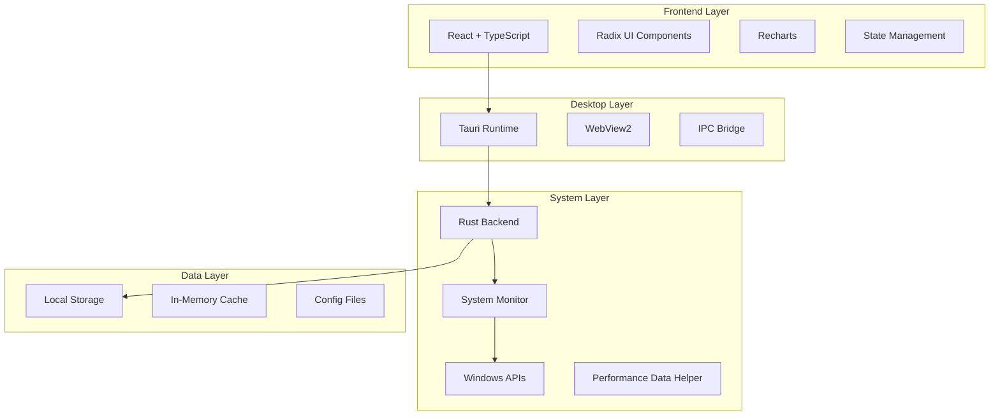

# VERA Architecture Documentation

## Overview

VERA Environmental Awareness è un'applicazione desktop multi-tier costruita con un'architettura moderna e modulare che combina le migliori tecnologie web e native.

## Architettura Generale



## Componenti Principali

### 1. Frontend (React + TypeScript)

**Responsabilità:**
- Interfaccia utente responsive
- Visualizzazione dati in tempo reale
- Gestione stato dell'applicazione
- Routing e navigazione

**Tecnologie:**
- React 18 con Hooks
- TypeScript per type safety
- Vite per build e HMR
- Tailwind CSS per styling
- Radix UI per componenti accessibili

**Struttura:**
```
frontend/src/
├── components/          # Componenti riusabili
│   ├── ui/             # Componenti base UI
│   ├── charts/         # Componenti grafici
│   └── panels/         # Pannelli dashboard
├── hooks/              # Custom hooks
├── utils/              # Utility functions
└── types/              # TypeScript definitions
```

### 2. Desktop Runtime (Tauri)

**Responsabilità:**
- Bridge tra frontend web e backend Rust
- Gestione finestre e UI nativa
- Sicurezza e sandboxing
- Comunicazione IPC

**Configurazione:**
```json
{
  "build": {
    "frontendDist": "../frontend/dist",
    "beforeBuildCommand": "npm run build --workspace=frontend"
  },
  "app": {
    "security": {
      "csp": "default-src 'self'; script-src 'self' 'unsafe-inline'"
    }
  }
}
```

### 3. System Backend (Rust)

**Responsabilità:**
- Monitoraggio hardware in tempo reale
- Accesso sicuro alle API di sistema
- Elaborazione dati di performance
- Calcoli di efficienza energetica

**Moduli:**
```rust
src/
├── main.rs                 # Entry point
├── system_monitor/         # Core monitoring
│   ├── cpu.rs             # CPU monitoring
│   ├── memory.rs          # RAM monitoring
│   ├── storage.rs         # Disk monitoring
│   └── network.rs         # Network monitoring
├── permissions/           # Security handling
└── utils/                 # Helper functions
```

## Data Flow

### 1. Raccolta Dati

```
Windows PDH API → Rust Backend → Data Processing → IPC → Frontend
```

1. **Windows Performance Data Helper (PDH)** raccoglie metriche sistema
2. **Rust Backend** processa e normalizza i dati
3. **IPC Bridge** trasferisce dati al frontend
4. **React Components** visualizzano i dati

### 2. Ciclo di Aggiornamento

```typescript
// Frontend Hook Pattern
const useSystemMonitor = () => {
  const [metrics, setMetrics] = useState<SystemMetrics>();
  
  useEffect(() => {
    const interval = setInterval(async () => {
      const data = await invoke('get_system_metrics');
      setMetrics(data);
    }, 1000);
    
    return () => clearInterval(interval);
  }, []);
  
  return metrics;
};
```

### 3. Comunicazione IPC

```rust
// Rust Command
#[tauri::command]
async fn get_system_metrics() -> Result<SystemMetrics, String> {
    let cpu_usage = cpu::get_usage().await?;
    let memory_info = memory::get_info().await?;
    let storage_info = storage::get_info().await?;
    
    Ok(SystemMetrics {
        cpu: cpu_usage,
        memory: memory_info,
        storage: storage_info,
        timestamp: SystemTime::now(),
    })
}
```

## Security Model

### Tauri Security

- **Sandboxed WebView:** Frontend isolato dal sistema
- **Allowlist Commands:** Solo comandi espliciti permessi
- **CSP Headers:** Content Security Policy rigoroso
- **No eval():** Prevenzione code injection

### System Access

- **Privilege Separation:** Frontend non accede direttamente al sistema
- **Validated Commands:** Tutti i comandi IPC validati
- **Error Handling:** Gestione sicura degli errori

## Performance Optimizations

### 1. Frontend

- **Code Splitting:** Componenti caricati on-demand
- **Memoization:** React.memo per componenti pesanti
- **Virtual Scrolling:** Per liste lunghe
- **Debounced Updates:** Riduzione re-render

### 2. Backend

- **Async Processing:** Operazioni non bloccanti
- **Caching:** Cache intelligente dei dati
- **Batch Operations:** Raggruppamento chiamate sistema
- **Memory Management:** Gestione efficiente memoria Rust

### 3. Data Transfer

- **JSON Compression:** Compressione dati IPC
- **Selective Updates:** Solo dati modificati
- **Throttling:** Limitazione frequenza aggiornamenti

## Error Handling

### Frontend Error Boundaries

```typescript
class SystemMonitorErrorBoundary extends React.Component {
  componentDidCatch(error: Error, errorInfo: ErrorInfo) {
    console.error('System Monitor Error:', error, errorInfo);
    // Fallback to mock data
    this.setState({ hasError: true, usesMockData: true });
  }
}
```

### Rust Error Propagation

```rust
#[derive(Debug, thiserror::Error)]
pub enum SystemError {
    #[error("Failed to access system metrics: {0}")]
    MetricsError(String),
    
    #[error("Insufficient permissions: {0}")]
    PermissionError(String),
}
```

## Build & Deployment

### Development

```bash
# Start dev environment
npm run dev

# Frontend only
npm run dev --workspace=frontend

# Tauri dev mode
npm run tauri:dev
```

### Production

```bash
# Build all workspaces
npm run build

# Create Tauri bundle
npm run tauri:build
```

### Distribution

- **Windows:** MSI installer via NSIS
- **Portable:** Standalone executable
- **Auto-updater:** Tauri built-in updater

## Monitoring & Debugging

### Development Tools

- **React DevTools:** Component inspection
- **Rust Analyzer:** IDE support
- **Tauri DevTools:** IPC debugging
- **Chrome DevTools:** Frontend debugging

### Logging

```rust
// Rust logging
log::info!("System metrics collected: CPU {:.1}%", cpu_usage);

// Frontend logging
console.log(`📊 VERA: CPU ${metrics.cpu.usage.toFixed(1)}%`);
```

## Extensibility

### Adding New Metrics

1. **Backend:** Implement new Rust module
2. **Types:** Update shared TypeScript types
3. **Frontend:** Create visualization component
4. **IPC:** Register new command

### Plugin Architecture

Future plans include plugin system for:
- Custom metrics
- Third-party integrations
- Custom visualizations
- Export formats